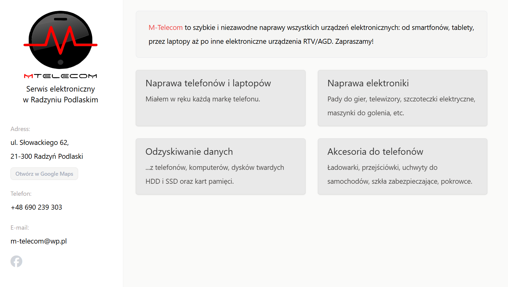

# MTelecom

MTelecom is a simple, one-page, responsive website for a local phone and electronics repair workshop. 

## Technologies Used

- Astro
- Tailwind CSS
- DaisyUI
- SCSS
- Prettier (for autoformatting)

## Deployment

The site is deployed on GitHub Pages at [mtelecom.zentala.io](https://mtelecom.zentala.io).

## Getting Started

1. Clone the repository.
2. Install dependencies using `npm install`.
3. Run the development server with `npm run dev`.

## Deployment Instructions

Push new commit to `main` branch and GitHub actions will handle the rest.
